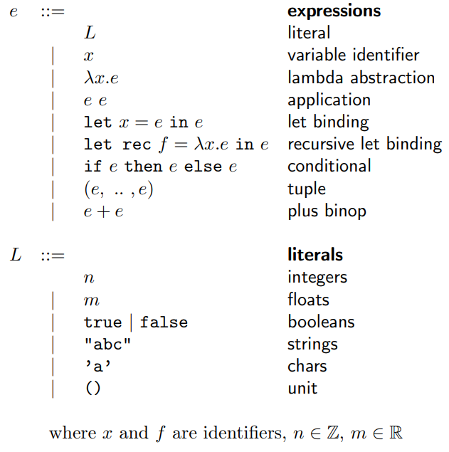
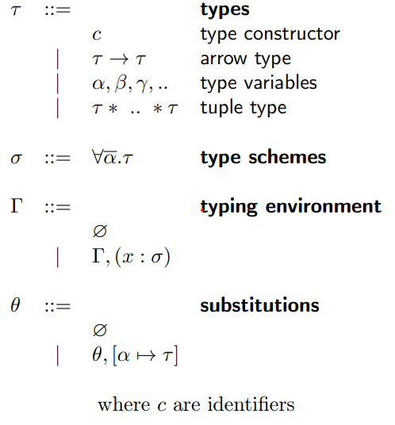
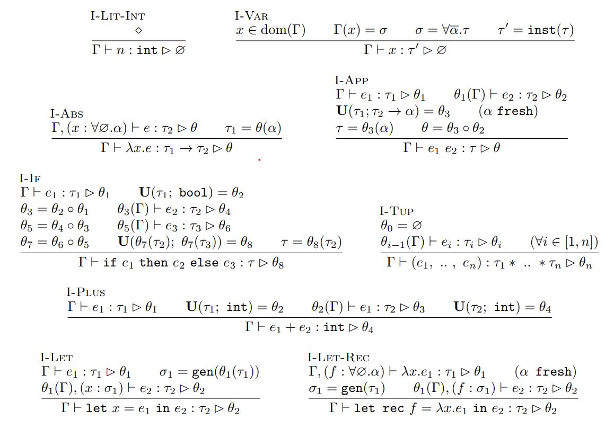

# TinyML
TinyML is an F# implementation of MetaLanguage's type inference system, albeit in a simplified form. This was a project assigned at the end of the course of [Functional Languages](https://en.didattica.unipd.it/off/2022/LM/SC/SC2598/000ZZ/SCP6076299/N0) at the University of Padova. The [skeleton](https://github.com/alvisespano/FunctionalLanguages-UniPD/tree/main/2022-23/TinyML) of the project was provided by the course's professor Alvise Spanò.

## Terms
The provided parser + lexer combo supports the following terms:  
  
  
For type inference purposes, operator terms for integers and floats have been implemented by extending the given configuration such that:  
Addition between integers uses the standard '+' character;  
Addition between floats uses the modified '+.' character.  
Operators for subtraction, multiplication, division, modulo and power have been implemented as well.  

## Types
The following grammars defines the constructs needed to implement the type inference algorithm:  
  
  
Type variables have been implemented as integers for ease of use.

## Type Inference Rules
The following derivations define how the type inference algorithm should behave on the supported terms:  
  
The gen function receives a type and promotes it to type scheme, whereas the inst function does the opposite, which means it produces a concrete type from a type scheme.

## Expressions
The project can be run either in interactive mode or standard mode.  
When launched in interactive mode a terminal screen will appear awaiting expressions to infer. For each computation the environment will be expanded upon and utilized by subsequent ones.  
Standard mode instead will simply locate the 'test.tml' file, infer the type of its expression and return the results.  
  
In either case the algorithm expects expressions to be formed in the following way:  
e1 <b>in</b> e2 <b>in</b> ... <b>in</b> en<b>;;</b>  
whereas each e is a sub-expression and the double colon mark the end of line. 
